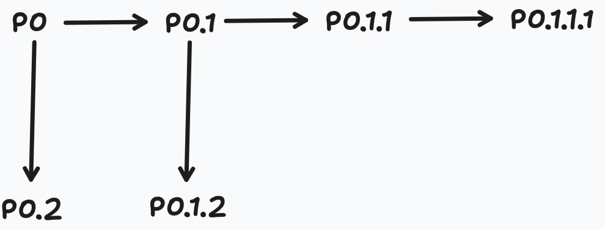

## Unit 1: `fork()`, process trees, and process states

This is a particularly high-priority unit: the newer exam contained code using `fork()` and asked for the number of processes, return values, executed branches, and the five process states. 13-Ged-chtnisprotokoll_Klausur\_-IBN_Ersttermin.pdf

### 1. What is a process?

A **program** is passive executable code stored in a file. A **process** is an instance of a program currently being executed.

A process includes:

- its program code;
- stack, heap and global data;
- CPU state, such as the program counter and registers;
- operating-system information stored in its **Process Control Block (PCB)**:
  - process ID;
  - current process state;
  - scheduling information;
  - memory-management information;
  - open resources.

Multiple processes can therefore execute the same program while having different variables, stacks, registers and process IDs.

---

## 2. What does `fork()` do?

In a POSIX system,

```c
pid_t p = fork();
```

creates **one new child process**.

Immediately after a successful call, there are two processes:

- the original **parent process**;
- the newly created **child process**.

Both continue execution at the instruction immediately following `fork()`.

Conceptually, the child receives a copy of the parent’s state at the moment of the call:

- program code;
- stack, heap and global variables;
- environment;
- open file descriptors;
- current position in the program.

Ordinary variables are subsequently independent. Changing a variable in the child does not change the parent’s corresponding variable.

In practice, the memory pages are usually initially shared using **copy-on-write** and copied only when one process modifies them. For the exam, however, you can reason as if each process has its own copy.

### Return value

The processes distinguish themselves using the return value:

| Result of `fork()` | Meaning |
|---|---|
| `p > 0` | This is the parent; `p` is the child’s PID |
| `p == 0` | This is the child |
| `p == -1` | Creation failed; no child was created |

A very common pattern is therefore:

```c
pid_t p = fork();

if (p == 0) {
    // Executed by the child
} else if (p > 0) {
    // Executed by the parent
} else {
    // Error handling
}
```

The exact positive PID is normally unknown unless it is provided.

### Crucial distinction

`fork()` is called once, but it **returns twice**:

- once in the parent, with a positive value;
- once in the child, with zero.

---

## 3. Counting processes

Every process that reaches a successful `fork()` creates one additional process.

Thus, if there are \(k\) processes immediately before a `fork()` and all \(k\) execute it successfully, there will be

$$
2k
$$

processes afterwards.

For $n$ successive unconditional calls,

```c
fork();
fork();
fork();
```

the total number is

$$
2^n.
$$

Here, three calls produce $2^3=8$ processes, including the original process.

This shortcut works only when **every existing process executes every call**. With conditions, loops, `exit()`, or `exec()`, you must trace the individual execution paths.

---

## 4. The safe process-tree method

For each `fork()`:

1. Identify every process that reaches the call.
2. Give each of them one new child.
3. Copy the parent’s current variable values into the child.
4. Assign the appropriate return value:
   - parent receives a positive PID;
   - child receives zero.
5. Continue tracing every resulting process separately.

Do not count the number of occurrences of the word `fork` and immediately use $2^n$. A conditional call may be reached by only part of the process tree.

### Example

```c
pid_t p = fork();

if (p == 0)
    fork();
```

After the first call:

- parent: `p > 0`;
- child: `p == 0`.

Only the child enters the `if` and executes the second call. Consequently, there are three processes, not four.

---

## 5. Process hierarchy

Each child has:

- its own PID;
- the PID of its parent, called its PPID.

This produces a process tree. A child created later by an existing child becomes a **grandchild** of the original process.

The parent and child normally execute concurrently. The scheduler may run either one first, so the order of their output is generally not predictable.

However, the order of instructions **inside one process** remains fixed.

---

## 6. The five basic process states

The five-state model required by the course is: 01-ibn-zusammenfassung.pdf

| State | Meaning |
|---|---|
| **New** | The process is being created. |
| **Ready** | It can execute but is waiting for a CPU. |
| **Running** | Its instructions are currently being executed by a CPU. |
| **Waiting / Blocked** | It cannot continue until some event occurs, such as completion of I/O. |
| **Terminated** | It has finished execution or has been terminated. |

The important distinction is:

- **Ready:** capable of running, but no CPU currently assigned;
- **Waiting:** not capable of continuing yet, even if a CPU were available.

### State transitions

| Transition | Typical cause |
|---|---|
| New → Ready | The process is admitted into the ready queue |
| Ready → Running | The scheduler dispatches it |
| Running → Ready | Time slice expires or the process is preempted |
| Running → Waiting | It requests I/O or waits for an event |
| Waiting → Ready | I/O completes or the awaited event occurs |
| Running → Terminated | It finishes or calls `exit()` |

Normally, a process does not move directly from Waiting to Running. Once its event occurs, it becomes Ready and waits to be selected by the scheduler.

### Where does `fork()` fit?

A parent must be **Running** to execute `fork()`. The operating system creates a child, which passes through New and becomes Ready. The scheduler then decides whether the parent or the child runs next.

Calling `fork()` does **not** guarantee that the child executes first.

---

## 7. Common exam traps

- Counting only the children and forgetting the original parent.
- Assuming that only the child continues after `fork()`.
- Reversing the return values: the child gets `0`; the parent gets the child’s PID.
- Assuming the parent always runs before the child.
- Forgetting that descendants inherit the current value of previously assigned variables.
- Using \(2^n\) even though some calls are conditional.
- Confusing Ready with Waiting.
- Claiming that I/O completion causes Waiting → Running directly.

Sheet 2 contains the corresponding course practice involving return values, conditional calls and process trees. 03-ueb02-ibn-SS2025.pdf

# Exam-like exercise

Try this closed-book and give yourself approximately **15 minutes**.

Assume that every `fork()` succeeds.

```c
#include <stdio.h>
#include <unistd.h>

int main(void)
{
    int x = 0;

    pid_t p = fork();             // F1

    if (p == 0) {
        x = 1;
        fork();                   // F2
    } else {
        x = 2;
        fork();                   // F3
    }

    if (p == 0) {
        x = x + 10;
        fork();                   // F4
    }

    printf("p-category=%s, x=%d\n",
           p == 0 ? "zero" : "positive", x);

    return 0;
}
```

### Part A: `fork()` and the process tree

1. How many processes exist at the end, including the original process?
2. How many times is `printf()` executed?
3. Draw the process tree. Label the original process \(P_0\), and label each new process according to the call that created it.
4. How many final processes have:
   - `p == 0`;
   - `p > 0`?
5. Which processes execute:
   - the first `if` branch;
   - the `else` branch;
   - the second `if` branch?
6. What is the final value of `x` in each process?
7. Is the order of the printed lines uniquely determined? Explain briefly.
8. Can the exact positive value of `p` be determined from the code alone? What does that value represent?

A table may make your tracing easier:

| Final process | Parent | Created by | `p` category | Final `x` | Executes second `if`? |
|---|---|---|---|---:|---|
| $P_0$ | — | — |  |  |  |
| … |  |  |  |  |  |


### Part B: Process states

Give the state transition caused by each event:

1. A process has just been admitted by the operating system and may now compete for the CPU.
2. The scheduler selects it for execution.
3. Its time slice expires.
4. It is selected again and then requests data from the disk.
5. The disk operation finishes.
6. The scheduler selects it again.
7. The process calls `exit()`.

Write the answer in the form:

$$
\text{Ready} \rightarrow \text{Running}
$$

Send me your solution—even if parts are uncertain—and I’ll correct it step by step before we move to race conditions and synchronization.

## Answers 

### Part A 

1. there are 6 processes 
2. each process executes printf once, therefore 6 times
3. {width=75%} 
4. P0, P0.2 have `p > 0`, i.e. 2 processes have positive `p`, and P0.1, P.0.1.1, P0.1.1.1, P0.1.2 have `p == 0`, i.e. 4 have zero `p`.
5. first if branch executed by: P0.1  
   else branch: P0  
   second if branch: P0.1, P0.1.1
6. final x value of each process:
   P0: 2  
   P0.1: 11  
   P0.1.1: 11  
   P0.1.1.1: 11  
   P0.2 : 2  
   P0.1.2: 11
7. no, because the scheduler arbitrarily decides in which order the parent and children processes are scheduled
8. No, a positive `p` value represents the PID of the generated child process and is
   internally determined by the OS

### Part B

1. new -> ready
2. ready -> running 
3. running -> ready
4. running -> waiting
5. waiting -> ready
6. ready -> running
7. running -> terminated
   